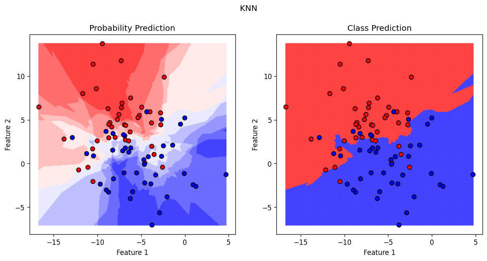
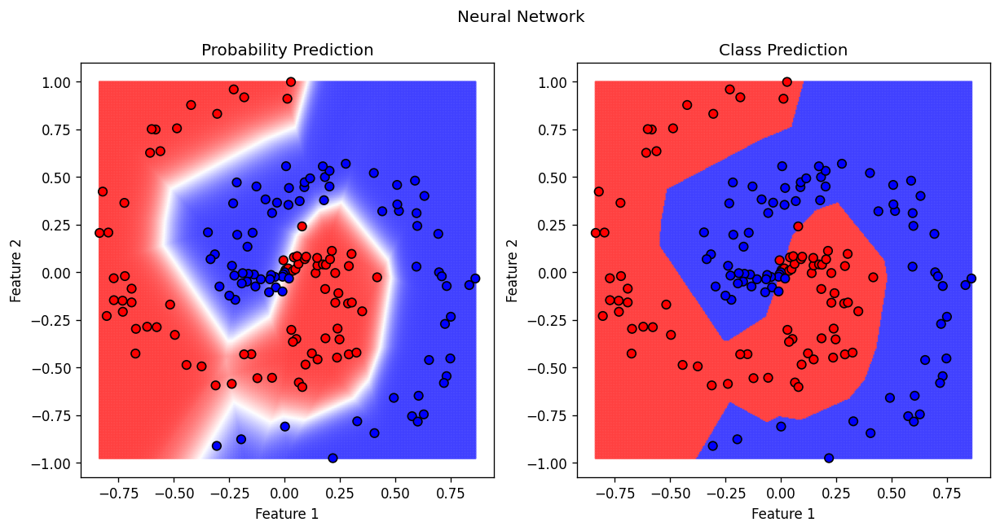

# MLVisual: Machine Learning Algorithm Visualiser

This repository contains concise, prototype NumPy implementations of common machine learning classification algorithms and a tool for visualising the performance of the algorithms using several simple synthetic datasets. The aim is to provide a resource for facilitating an intuitive understanding of how these algorithms work and how they can be practically implemented in code.

The algorithms currently implemented are:
* Logistic Regression
* K-Nearest Neighbours
* Naive Bayes
* Decision Tree
* Random Forest
* AdaBoost
* Support Vector Machine
* Neural Network

## Visualiser Usage

The `visualise_synthetic` function in `utils.py` allows model probability and class predictions to be visualised using a choice of synthetic 2D binary classification datasets. It is used as follows:

----

**`visualise_synthetic(model, title, dataset)`** - Create the model visualisation

Parameters:

`model` (LogisticRegression | NearestNeightbours | NaiveBayes | DecisionTree | RandomForest | AdaBoost | SupportVectorMachine | NeuralNetwork)
    - Instance of model class with methods `fit`, `predict_proba` and `predict`

`title` (str)
    - Figure title

`dataset` (str)
    - The dataset to use for visualisation. Must be one of 'separable_blobs', 'overlapping_blobs', 'circles', 'moons' or 'spiral'.

----

### Example 1

```python
from NearestNeighbours import NearestNeighbours
from utils import visualise_synthetic

knn_model = NearestNeighbours(k=9)

visualise_synthetic(knn_model, "KNN", 'overlapping_blobs')
```


### Example 2

```python
from NeuralNetwork import NeuralNetwork
from utils import visualise_synthetic

neural_network = NeuralNetwork(hidden_shape=[7, 7], learning_rate=1e-3, epochs=100000)

visualise_synthetic(neural_network, "Neural Network", "spiral")
```


## Algorithms Usage

Each of the algorithms is implemented using a dedicated class with the following methods:

----

**`fit(X_train, y_train)`** - Fit the model to training data.

Parameters:

`X_train` (np.ndarray)
    - Training data of shape (n_samples, n_features)

`y_train` (np.ndarray)
    - Target values of shape (n_samples,)

Returns:

`Self`
    - The fitted model

----

**`predict_proba(X_test)`** - Predict the class probabilities for the test data.

Parameters:

`X_test` (np.ndarray)
    - Test data of shape (n_samples, n_features)

Returns:

`pred_probs`: (np.ndarray)
    - Predicted class probabilities of shape (n_classes, n_samples).

----

**`predict(X_test)`** - Predict the target variable for the test data.

Parameters:

`X_test` (np.ndarray)
    - Test data of shape (n_samples, n_features)

Returns:

`y_pred`: (np.ndarray)
    - Predicted target values of shape (n_samples,).

----
