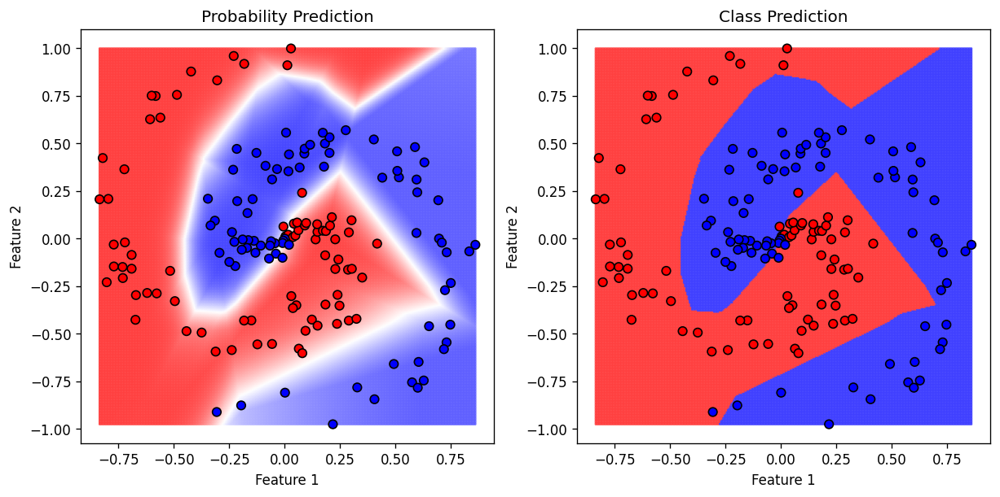

# MLVisual: Machine Learning Algorithm Visualiser

This repository contains concise, prototype NumPy implementations of common machine learning classification algorithms as well as a tool for visualising the performance of the algorithms using a simple dataset with two input features. The aim is to provide a resource for facilitating inuitive understanding of how these algorithms work and how they can be practically implemented in code.

The algorithms currently implemented are:
* Logistic Regression
* K-Nearest Neighbours
* Naive Bayes
* Decision Tree
* Random Forest
* AdaBoost
* Support Vector Machine
* Neural Network

## Visualiser Usage

The `visualise_synthetic` function in `utils.py` allows algorithm probability and class predictions to be visualised using a synthetic 2D binary classification dataset. It is used as follows:

`visualise_synthetic(model, title, dataset)` - Create the model visualisation

    Parameters:

    `model` : LogisticRegression | NearestNeightbours | NaiveBayes | DecisionTree | RandomForest | AdaBoost | SupportVectorMachine | NeuralNetwork
        - Instance of model class with methods `fit`, `predict_proba` and `predict`

    `title` : str
        - Figure title

    `dataset` : str
        - The dataset to use for visualisation. Must be one of 'separable_blobs', 'overlapping_blobs', 'circles', 'moons' or 'spiral'.

### Example 1

```python
from NearestNeighbours import NearestNeighbours
from utils import visualise_synthetic

knn_model = NearestNeighbours(k=9)

visualise_synthetic(knn_model, "KNN", 'overlapping_blobs')
```


### Example 2

```python
from NeuralNetwork import NeuralNetwork
from utils import visualise_synthetic

neural_network = NeuralNetwork(hidden_shape=[7, 7], learning_rate=1e-3, epochs=100000)

visualise_synthetic(neural_network, "Neural Network", "spiral")
```


## Algorithms Usage

Each of the algorithms is implemented using a dedicated class with the methods:

`fit(X_train, y_train)` - Fit the model to training data

    Parameters:

    `X_train` : NumPy array of shape (n_samples, m_features)
        - Training data

    `y_train` : numpy array of shape (n_samples,)
        - Target values

    Returns:

    `self`:
        - Fitted model


`predict(X_test)` - Predict the target variable for the test data

    Parameters:

    `X_test` : NumPy array of shape (n_samples, m_features)
        - Test data

    Returns:

    `y_pred`:
        - Predicted target values